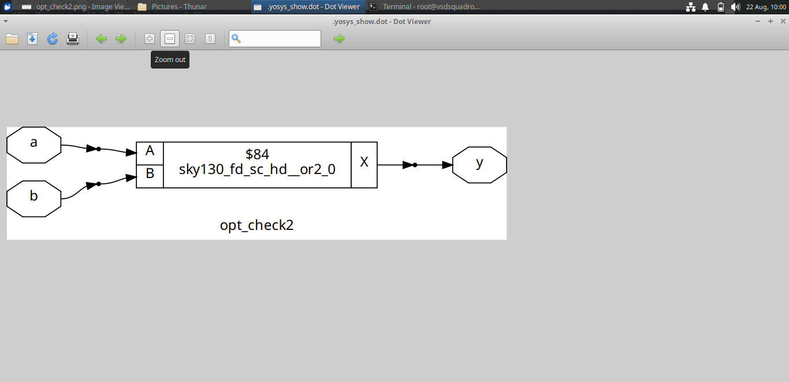
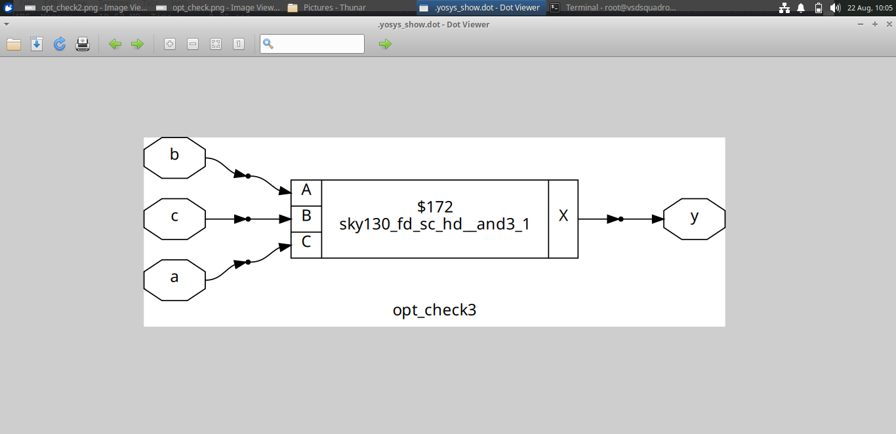
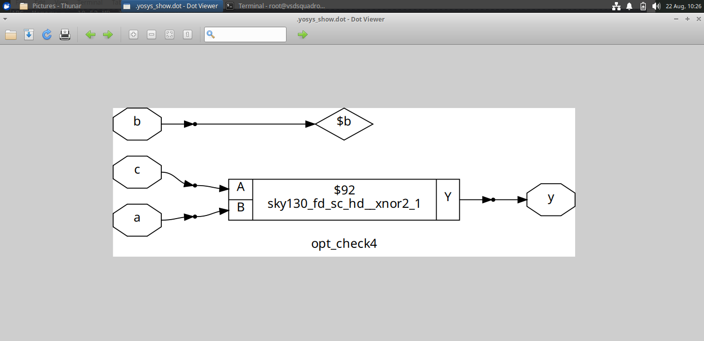

# Day 3 – Combinational and Sequential Logic Optimizations

## 🎯 Objective

The objective of Day 3 was to study how RTL designs can be optimized during synthesis.

The experiments covered:

- Introduction to RTL optimization
- Combinational logic optimization
- Sequential logic optimization
- Optimization of unused sequential outputs
- Constant propagation
- Flip-flop optimization
- Synthesis using Yosys
- Verification using Icarus Verilog and GTKWave
- Technology mapping using the SKY130 standard-cell library

---

## 📑 Contents

- [1. Introduction to RTL Optimization](#1-introduction-to-rtl-optimization)
- [2. Combinational Logic Optimization](#2-combinational-logic-optimization)
- [3. Sequential Logic Optimization](#3-sequential-logic-optimization)
- [4. Sequential Optimization for Unused Outputs](#4-sequential-optimization-for-unused-outputs)
- [5. Simulation and Waveform Analysis](#5-simulation-and-waveform-analysis)
- [6. Yosys Synthesis Flow](#6-yosys-synthesis-flow)
- [7. Observations](#7-observations)
- [8. Conclusion](#8-conclusion)

---

# 1. Introduction to RTL Optimization

RTL optimization is the process of simplifying a digital design while maintaining its required functionality.

During synthesis, Yosys analyzes the RTL description and performs optimization before converting the design into a technology-specific gate-level implementation.

Some common optimization techniques include:

- Removing redundant logic
- Propagating constant values
- Simplifying Boolean expressions
- Removing unnecessary logic
- Optimizing sequential elements
- Mapping logic to suitable standard cells

The general flow is:

```text
Verilog RTL
     ↓
RTL Analysis
     ↓
Optimization
     ↓
Synthesis
     ↓
Technology Mapping
     ↓
SKY130 Standard Cells
     ↓
Gate-Level Circuit
```

Optimization helps reduce unnecessary hardware and can improve the overall implementation of a digital circuit.

---

# 2. Combinational Logic Optimization

Combinational logic produces outputs based on the present input values.

The experiments in this section examined how basic Boolean operations are represented after synthesis.

---

## 2.1 AND Logic

The first experiment examined a two-input AND operation.

The inputs were:

```text
a
b
```

and the output was:

```text
y
```

### Synthesized Circuit


The synthesized result shows the logic being implemented using a SKY130 AND standard cell.

This demonstrates how an RTL Boolean expression is mapped to a technology-specific cell during synthesis.

---

## 2.2 OR Logic

The second experiment examined a two-input OR operation.

### Synthesized Circuit



The synthesized circuit uses a SKY130 OR standard cell to implement the required Boolean function.

This shows the conversion from the RTL description to a gate-level technology-mapped representation.

---

## 2.3 Three-Input AND Logic

The next experiment used three input signals:

```text
a
b
c
```

### Synthesized Circuit



The synthesized circuit contains a SKY130 three-input AND cell.

This demonstrates how the synthesis tool identifies the required logic function and maps it to an available standard cell.

---

## 2.4 XNOR Logic and Constant Propagation

Another experiment involved XNOR logic and a signal that became constant during optimization.

### Synthesized Circuit



The synthesized circuit contains a SKY130 XNOR cell.

The constant signal demonstrates constant propagation, where the synthesis tool uses a known value to simplify the surrounding logic.

---

# 3. Sequential Logic Optimization

Sequential circuits contain storage elements such as flip-flops.

Their behavior depends on the clock, input signals and previously stored state.

The experiments in this section examined how sequential circuits are represented and optimized during synthesis.

---

## 3.1 Counter Optimization

A counter design was synthesized to observe its gate-level implementation.

### Synthesized Counter


The synthesized design contains flip-flops together with combinational logic used for determining the next state.

This experiment helped in understanding how RTL sequential logic is converted into technology-specific hardware.

---

## 3.2 Modified Counter

A modified counter design was also synthesized.

### Synthesized Modified Counter


Comparing different RTL implementations helps show how changes in the RTL structure can influence the resulting synthesized circuit.

---

# 4. Sequential Optimization for Unused Outputs

Sequential optimization can also be performed when a stored signal does not contribute to a required output.

If a sequential element does not affect any observable output, synthesis can identify that logic as unnecessary.

A simple representation is:

```text
       Clock
         |
         ↓
    +---------+
    | Flip-Flop|
    +---------+
         |
         ↓
   Unused Signal
         |
         X
```

Removing unnecessary logic can reduce the hardware required in the final implementation.

---

# 5. Simulation and Waveform Analysis

The sequential designs were simulated using Icarus Verilog.

The generated waveform files were examined using GTKWave.

The important signals observed included:

- Clock
- Reset
- Data
- Flip-flop output
- Other sequential signals

---

## 5.1 D Flip-Flop with Constant Input

One experiment used a D flip-flop with a constant input condition.

### Synthesized Circuit


### GTKWave Result


The waveform was used to observe the relationship between the clock, reset and output.

---

## 5.2 Second Constant Flip-Flop Case

A second sequential experiment was performed with a constant input condition.

### Synthesized Circuit


### GTKWave Result


The waveform was examined to verify the sequential behavior of the circuit.

---

## 5.3 Sequential Circuit with Multiple Flip-Flops

A more complex sequential circuit containing multiple flip-flops was also synthesized.

### Synthesized Circuit


### GTKWave Result


The waveform was used to observe the transitions of the sequential signals.

---

# 6. Yosys Synthesis Flow

Yosys was used to synthesize and visualize the RTL designs.

## Start Yosys

```bash
yosys
```

## Read the RTL

```text
read_verilog design.v
```

## Select the Top Module

```text
hierarchy -top module_name
```

## Perform Synthesis

```text
synth -top module_name
```

## Read the SKY130 Library

```text
read_liberty -lib /path/to/sky130_fd_sc_hd__tt_025C_1v80.lib
```

## Map Flip-Flops

```text
dfflibmap -liberty /path/to/sky130_fd_sc_hd__tt_025C_1v80.lib
```

## Technology Mapping

```text
abc -liberty /path/to/sky130_fd_sc_hd__tt_025C_1v80.lib
```

## Display the Circuit

```text
show
```

The `show` command was used to generate the synthesized circuit diagrams included in this repository.

---

# 7. Observations

| Experiment | Observation |
|---|---|
| AND logic | The RTL AND operation was mapped to a SKY130 AND cell |
| OR logic | The RTL OR operation was mapped to a SKY130 OR cell |
| Three-input AND | The logic was mapped to a suitable SKY130 standard cell |
| XNOR logic | The XNOR function was represented using a SKY130 XNOR cell |
| Constant signal | Constant propagation simplified part of the logic |
| Counter | Sequential logic was represented using flip-flops and combinational logic |
| Unused output | Unnecessary sequential logic can be removed during optimization |
| Constant D input | A constant input produces predictable sequential behavior |

---

# 8. Conclusion

Day 3 provided practical understanding of combinational and sequential RTL optimization.

The combinational experiments demonstrated how Boolean operations such as AND, OR, three-input AND and XNOR are converted into SKY130 standard-cell implementations.

The sequential experiments demonstrated the synthesis of counters and flip-flop based circuits. Constant values and unnecessary logic were also studied as part of the optimization process.

The designs were simulated using Icarus Verilog and the resulting waveforms were examined using GTKWave. Yosys was used for synthesis, optimization and visualization of the gate-level circuits.

The overall process studied was:

```text
RTL Coding
    ↓
Simulation
    ↓
RTL Optimization
    ↓
Synthesis
    ↓
Technology Mapping
    ↓
Gate-Level Representation
```

The circuit diagrams and waveform screenshots included in this folder were obtained from my own lab experiments.
